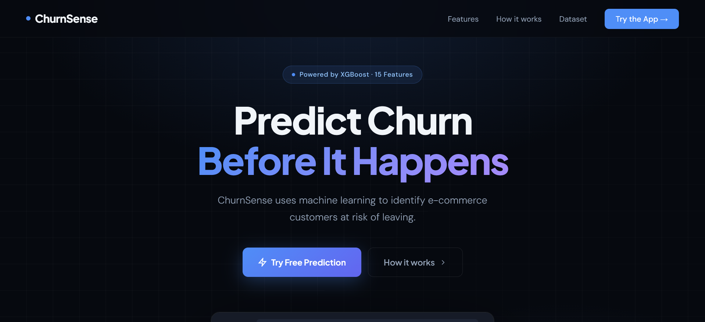
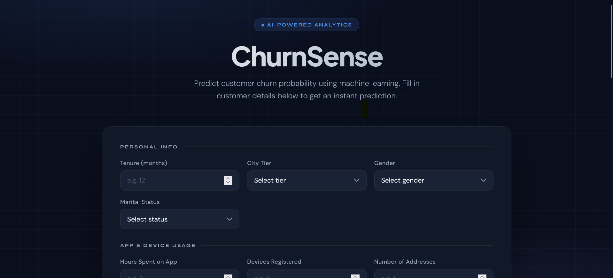
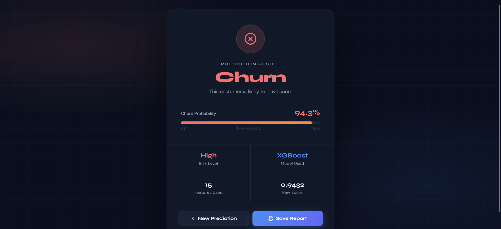

# ChurnSense | E-Commerce Customer Churn Prediction


A machine learning web application that predicts whether an e-commerce customer will churn, built as an end-to-end data science project — from exploratory data analysis to model deployment with a modern Flask web interface.

> **Learning Focus**: This project demonstrates the full ML lifecycle: EDA → Feature Engineering → Model Selection → Evaluation → Deployment.

---

## Preview

| Landing Page | Prediction Form | Result |
|---|---|---|
|  |  |  |

---

## Project Structure

```
ecommerce-churn-prediction/
│
├── app.py                          
├── requirements.txt              
├── E Commerce Dataset.xlsx       
│
├── templates/
│   ├── landing.html                
│   ├── index.html                  
│   └── result.html                 
│
├── models/
│   ├── churn_prediction_model.pkl  
│   └── columns.json                
│
└── notebook/
    └── ecommerce_customer_churn_prediction.ipynb  
```

---

## What This Project Covers

### 1. Exploratory Data Analysis (EDA)
- Distribution plots for all categorical and numerical features
- Churn distribution analysis across customer segments
- Missing value visualization with `missingno`
- Correlation analysis and feature relationships

### 2. Data Preprocessing
- **Missing value imputation** using `IterativeImputer` with `RandomForestRegressor`
- **One-hot encoding** for categorical variables (gender, marital status, login device, payment mode, order category)
- **Class imbalance handling** using SMOTE (Synthetic Minority Over-sampling Technique)

### 3. Model Selection & Evaluation
Models compared using 5-fold cross-validation:

![Comparison Model][assets/compare_model.png]

Final Model Comparison
| Model Name | Accuracy |
|---|---|
| Random Forest | 0.9662522202486679 |
| XGBoost | 0.9769094138543517 |

> **XGBoost** selected as final model for highest overall performance.

### 4. Feature Importance
Top features by XGBoost gain score:
1. `tenure` — customer lifetime duration
2. `cashbackamount` — total cashback received
3. `satisfactionscore` — customer satisfaction rating
4. `complain` — whether customer filed a complaint
5. `daysincelastorder` — recency of last purchase

### 5. Web Deployment (Flask)
- **Landing page** — SaaS-style product showcase
- **Prediction form** — 15-feature input form with field explanations
- **Result page** — visual probability meter, risk classification, exportable report

---

## Tech Stack

| Layer | Technology |
|---|---|
| Language | Python 3.10+ |
| ML Framework | scikit-learn, XGBoost, imbalanced-learn |
| Data Processing | pandas, numpy |
| Visualization | matplotlib, seaborn, plotly |
| Web Framework | Flask |
| Frontend | HTML5, CSS3 (custom dark UI, no framework) |
| Model Serialization | pickle |
| Dataset | E-Commerce Customer Dataset (Excel) |

---

## How to Run Locally

### 1. Clone the repository
```bash
git clone https://github.com/YOUR_USERNAME/churnsense.git
cd churnsense
```

### 2. Install dependencies
```bash
pip install -r requirements.txt
```

### 3. Make sure model files exist
The `models/` folder must contain:
- `churn_prediction_model.pkl`
- `columns.json`

If not, run the notebook first to generate them:
```bash
jupyter notebook notebook/ecommerce_customer_churn_prediction.ipynb
```
Then **Kernel → Restart & Run All**.

### 4. Run the Flask app
```bash
python app.py
```

### 5. Open in browser
```
http://127.0.0.1:5000
```

---

## Dataset Info

| Property | Value |
|---|---|
| Source | E-Commerce Customer Dataset |
| Total Records | 5,630 customers |
| Churn Rate | ~16.8% |
| Features | 20 raw → 15 selected |
| Target | `Churn` (0 = Stay, 1 = Churn) |

**Selected features for deployment:**

| Feature | Type | Description |
|---|---|---|
| `tenure` | Numeric | Months since joining |
| `citytier` | Numeric | City classification (1/2/3) |
| `warehousetohome` | Numeric | Distance from warehouse (km) |
| `gender` | Categorical | Male / Female |
| `hourspendonapp` | Numeric | Daily app usage (hours) |
| `numberofdeviceregistered` | Numeric | Registered devices count |
| `satisfactionscore` | Numeric | Rating 1–5 |
| `maritalstatus` | Categorical | Single / Married / Divorced |
| `numberofaddress` | Numeric | Saved delivery addresses |
| `complain` | Binary | Filed complaint (0/1) |
| `orderamounthikefromlastyear` | Numeric | YoY order growth (%) |
| `couponused` | Numeric | Total coupons used |
| `ordercount` | Numeric | Total orders placed |
| `daysincelastorder` | Numeric | Days since last purchase |
| `cashbackamount` | Numeric | Total cashback received |

---

## Key Learnings

- **SMOTE** significantly improved recall for the minority class (churners) from ~72% to ~94%
- **XGBoost** outperforms linear models because churn behavior is non-linear
- **Feature reduction** from 20 → 15 features maintained accuracy while simplifying the deployment model
- **Iterative imputation** with Random Forest gives better results than simple mean/median imputation

---

## Requirements

```
flask
numpy
pandas
scikit-learn
xgboost
imbalanced-learn
openpyxl
matplotlib
seaborn
plotly
missingno
jupyter
```

---

## Disclaimer

This project is built for portfolio and learning purposes. The dataset comes from [Kaggle](https://www.kaggle.com/datasets/ankitverma2010/ecommerce-customer-churn-analysis-and-prediction).

---

## Author

**Yan Andhinaya Ardika**
- GitHub: [yanardika](https://github.com/yanardika)

---
